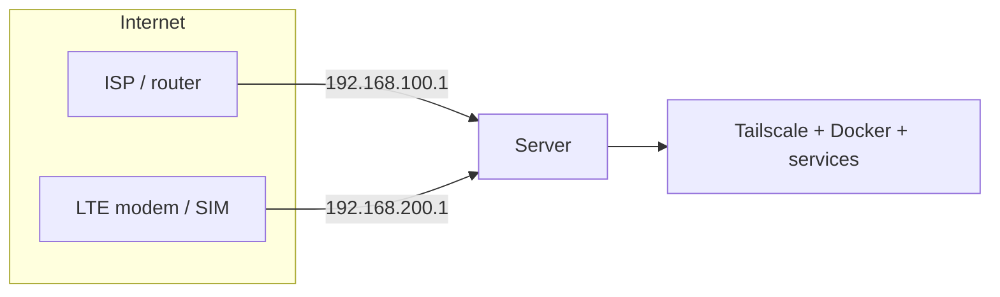
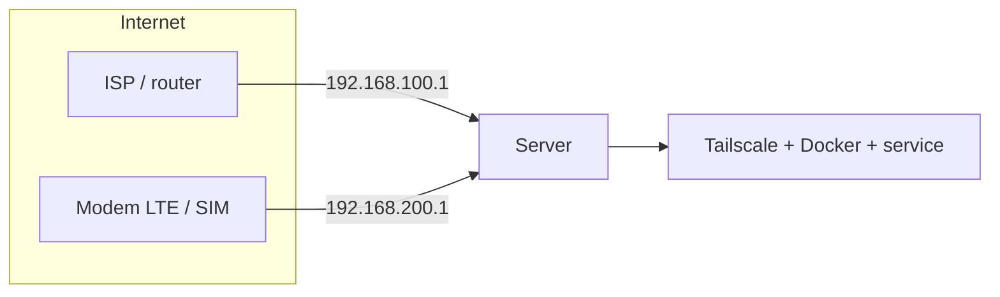

<div align="center">

<pre>

</pre>

**Automatic WAN failover: ISP ↔ LTE modem, for homelab.**  
*Failover otomatis: ISP ↔ modem LTE, untuk homelab.*

> *"WAN aja aku jagain, apalagi uptime kita 😭🙏💥💀"* — *"If I can keep your WAN alive, imagine what I’d do for our uptime  😭🙏💥💀"*

[](https://opensource.org/licenses/Apache-2.0)
[](#)
[](#)
[](#)

</div>

---

## 🇬🇧 English

### 💡 What is this?

A lightweight, budget-friendly **WAN failover** for homelab servers. When your ISP connection drops — whether the cable is unplugged **or** the upstream internet goes down while the link is still up — OPA-ISP2LTE automatically switches your default route to an LTE modem (SIM). When the ISP recovers and stays stable, it fails back automatically.

One bash script + one systemd unit. No expensive hardware, no proprietary software.

### 🤔 Why?

A homelab usually has a single ISP. When it dies, everything dies — Tailscale, Docker, self-hosted apps. OPA-ISP2LTE adds an LTE modem as a backup path and switches automatically.

### 🗺️ Architecture



Two paths enter the server through two interfaces on **different subnets**:

| Path | Interface (example) | Subnet | Gateway |
|---|---|---|---|
| ISP (primary) | `enx00e04c8f6956` | `192.168.100.0/24` | `192.168.100.1` |
| LTE modem | `enx0202025b3531` | `192.168.200.0/24` | `192.168.200.1` |

### ✅ Requirements

**Hardware**

1. **Broadband internet** — a primary connection that exposes itself as a network interface on the server. Either:
   - **Ethernet** (wired) — most common; or
   - **WiFi** — works as long as it shows up as an interface (e.g. `wlp2s0`).
   
   OPA-ISP2LTE works at the **interface level**, so any interface that has a default route can be the primary path.
2. **LTE modem (4G/5G) with a SIM** — plugged into the homelab server via **USB**. It must appear as a network interface (typically USB tethering / RNDIS, e.g. `enx…`). A phone in USB-tethering mode also works.

**Software / network**

3. **Two paths on different subnets** — never put the modem and ISP on the same subnet (routing will break).
4. **`conntrack`** installed (to flush stale connections on switch): `apt install conntrack`.
5. **Static IPs** on both interfaces (or DHCP reservation on the modem) so gateways never change.
6. *(Optional)* **Tailscale** — recommended as a stable access point that survives path changes.

### 🚀 Quick Start

```bash
curl -fsSL https://raw.githubusercontent.com/naufalmng/opa-isp2lte/main/install.sh | sudo bash
```

The installer detects interfaces, asks you to confirm gateways, then installs the script, service, and dependencies.

### ⚙️ Configuration

Config lives in `/etc/opa-isp2lte.conf` — use the `oitl` CLI (no manual editing):

```bash
oitl config list                  # view current config
oitl config set INTERVAL 5        # change a value
oitl config set FAILBACK_HOLD 120
```

| Key | Default | Meaning |
|---|---|---|
| `PRIMARY` / `BACKUP` | interface names | primary & backup paths |
| `PRIMARY_GW` / `BACKUP_GW` | gateway IPs | gateway for each path |
| `PING_TARGETS` | `8.8.8.8 1.1.1.1` | internet detection targets |
| `INTERVAL` | `10` | seconds between checks |
| `FAIL_THRESHOLD` | `3` | consecutive failures → switch |
| `FAILBACK_HOLD` | `60` | PRIMARY must be stable this many seconds before failing back |

After changing: `oitl restart` (applies instantly).

### 🛠️ Operations

```bash
oitl status                        # live status (route + links + daemon)
oitl log                           # last 30 log lines
oitl log -f                        # follow log live
oitl switch lte                    # manual switch to LTE
oitl switch isp                    # manual switch back to ISP
oitl switch auto                   # return to automatic
oitl restart                       # restart daemon
```

---

## 🇮🇩 Bahasa Indonesia

### 💡 Apa ini?

**Failover WAN** yang ringan dan hemat biaya untuk server homelab. Saat koneksi ISP putus — baik kabelnya tercabut **maupun** internet upstream-nya mati padahal link masih hidup — OPA-ISP2LTE otomatis memindahkan default route ke modem LTE (SIM). Saat ISP pulih dan stabil, otomatis kembali ke ISP.

Satu script bash + satu unit systemd. Tanpa perangkat mahal, tanpa software proprietary.

### 🤔 Kenapa?

Homelab biasanya cuma punya satu ISP. Saat ISP mati, semuanya ikut mati — Tailscale, Docker, aplikasi self-hosted. OPA-ISP2LTE menambahkan modem LTE sebagai jalur cadangan dan berpindah otomatis.

### 🗺️ Arsitektur



Dua jalur masuk ke server lewat dua interface pada **subnet yang berbeda**:

| Jalur | Interface (contoh) | Subnet | Gateway |
|---|---|---|---|
| ISP (utama) | `enx00e04c8f6956` | `192.168.100.0/24` | `192.168.100.1` |
| Modem LTE | `enx0202025b3531` | `192.168.200.0/24` | `192.168.200.1` |

### ✅ Syarat

**Perangkat keras (hardware)**

1. **Internet broadband** — koneksi utama yang muncul sebagai interface jaringan di server. Bisa:
   - **Ethernet** (kabel) — paling umum; atau
   - **WiFi** — jalan selama muncul sebagai interface (mis. `wlp2s0`).
   
   OPA-ISP2LTE bekerja di **level interface**, jadi interface apa pun yang punya default route bisa jadi jalur utama.
2. **Modem LTE (4G/5G) dengan SIM** — dicolok ke server homelab lewat **USB**. Harus muncul sebagai interface jaringan (biasanya USB tethering / RNDIS, mis. `enx…`). HP dalam mode USB-tethering juga bisa dipakai.

**Software / jaringan**

3. **Dua jalur beda subnet** — jangan biarkan modem & ISP di subnet yang sama (routing akan rusak).
4. **`conntrack`** terpasang (untuk flush koneksi lama saat switch): `apt install conntrack`.
5. **IP statis** di kedua interface (atau DHCP reservation di modem) agar gateway tidak berubah.
6. *(Opsional)* **Tailscale** — direkomendasikan sebagai akses stabil yang tidak terpengaruh pergantian jalur.

### 🚀 Instalasi cepat

```bash
curl -fsSL https://raw.githubusercontent.com/naufalmng/opa-isp2lte/main/install.sh | sudo bash
```

Installer mendeteksi interface, meminta konfirmasi gateway, lalu memasang script, service, dan dependensi.

### ⚙️ Konfigurasi

Config tersimpan di `/etc/opa-isp2lte.conf` — pakai CLI `oitl` (tanpa edit manual):

```bash
oitl config list                  # lihat config saat ini
oitl config set INTERVAL 5        # ubah nilai
oitl config set FAILBACK_HOLD 120
```

| Variabel | Default | Arti |
|---|---|---|
| `PRIMARY` / `BACKUP` | nama interface | jalur utama & cadangan |
| `PRIMARY_GW` / `BACKUP_GW` | IP gateway | gateway tiap jalur |
| `PING_TARGETS` | `8.8.8.8 1.1.1.1` | target deteksi internet |
| `INTERVAL` | `10` | detik antar cek |
| `FAIL_THRESHOLD` | `3` | gagal beruntun → switch |
| `FAILBACK_HOLD` | `60` | PRIMARY stabil segini detik baru failback |

Setelah ubah: `oitl restart` (langsung berlaku).

### 🛠️ Operasional

```bash
oitl status                        # status live (route + link + daemon)
oitl log                           # 30 baris log terakhir
oitl log -f                        # pantau log live
oitl switch lte                    # switch manual ke LTE
oitl switch isp                    # switch manual balik ke ISP
oitl switch auto                   # kembali ke otomatis
oitl restart                       # restart daemon
```

---

## 📁 Project Structure

```
opa-isp2lte/
├── install.sh           # interactive one-liner installer
├── oitl                 # CLI (config / status / switch / log)
├── opa-isp2lte.sh       # failover daemon (reads config)
├── opa-isp2lte.conf     # configuration template
├── opa-isp2lte.service  # systemd unit
└── README.md            # this file
```

## 📜 License

[Apache-2.0](https://opensource.org/licenses/Apache-2.0) — bebas dipakai & dimodifikasi. Made with ❤️ by **OPA** for budget-friendly homelabs.
