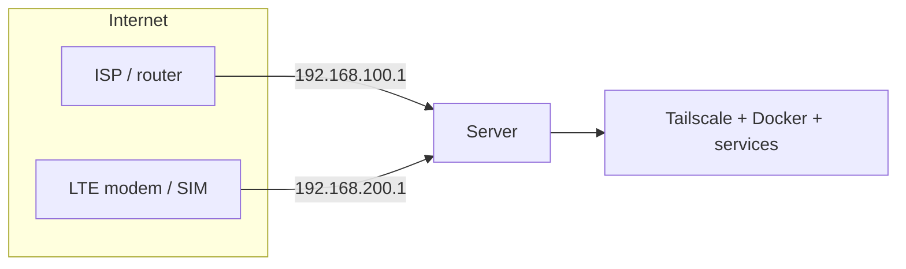
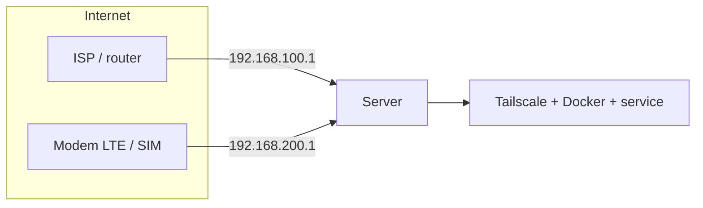

<div align="center">

# 📡 OPA-ISP2LTE

**Automatic WAN failover: ISP ↔ LTE modem, for homelab.**  
*Failover otomatis: ISP ↔ modem LTE, untuk homelab.*

> *"Opa jagain internet lo, biar nggak mati."* — *"Opa guards your internet so it never dies."*

```
 ██████╗ ██████╗  █████╗       ██╗███████╗██████╗ ██████╗ ██╗  ████████╗███████╗
██╔═══██╗██╔══██╗██╔══██╗      ██║██╔════╝██╔══██╗╚════██╗██║  ╚══██╔══╝██╔════╝
██║   ██║██████╔╝███████║█████╗██║███████╗██████╔╝ █████╔╝██║     ██║   █████╗
██║   ██║██╔═══╝ ██╔══██║╚════╝██║╚════██║██╔═══╝ ██╔═══╝ ██║     ██║   ██╔══╝
╚██████╔╝██║     ██║  ██║      ██║███████║██║     ███████╗███████╗██║   ███████╗
 ╚═════╝ ╚═╝     ╚═╝  ╚═╝      ╚═╝╚══════╝╚═╝     ╚══════╝╚══════╝╚═╝   ╚══════╝
```

[](https://opensource.org/licenses/Apache-2.0)
[](#)
[](#)
[](#)

</div>

---

## 🇬🇧 English

### 💡 What is this?

A lightweight, budget-friendly **WAN failover** for homelab servers. When your ISP connection drops — whether the cable is unplugged **or** the upstream internet goes down while the link is still up — OPA-ISP2LTE automatically switches your default route to an LTE modem (SIM). When the ISP recovers and stays stable, it fails back automatically.

One bash script + one systemd unit. No expensive hardware, no proprietary software.

### 🤔 Why?

A homelab usually has a single ISP. When it dies, everything dies — Tailscale, Docker, self-hosted apps. OPA-ISP2LTE adds an LTE modem as a backup path and switches automatically.

### 🗺️ Architecture



Two paths enter the server through two interfaces on **different subnets**:

| Path | Interface (example) | Subnet | Gateway |
|---|---|---|---|
| ISP (primary) | `enx00e04c8f6956` | `192.168.100.0/24` | `192.168.100.1` |
| LTE modem | `enx0202025b3531` | `192.168.200.0/24` | `192.168.200.1` |

### ✅ Requirements

1. **Two paths on different subnets** — never put the modem and ISP on the same subnet (routing will break).
2. **`conntrack`** installed (to flush stale connections on switch): `apt install conntrack`.
3. **Static IPs** on both interfaces (or DHCP reservation on the modem) so gateways never change.
4. *(Optional)* **Tailscale** — recommended as a stable access point that survives path changes.

### 🚀 Quick Start

```bash
curl -fsSL https://raw.githubusercontent.com/naufalmng/opa-isp2lte/main/install.sh | sudo bash
```

The installer detects interfaces, asks you to confirm gateways, then installs the script, service, and dependencies.

### ⚙️ Configuration

Edit the top of `opa-isp2lte.sh`:

| Variable | Default | Meaning |
|---|---|---|
| `PRIMARY` / `BACKUP` | interface names | primary & backup paths |
| `PRIMARY_GW` / `BACKUP_GW` | gateway IPs | gateway for each path |
| `PING_TARGETS` | `8.8.8.8 1.1.1.1` | internet detection targets |
| `INTERVAL` | `10` | seconds between checks |
| `FAIL_THRESHOLD` | `3` | consecutive failures → switch |
| `FAILBACK_HOLD` | `60` | PRIMARY must be stable this many seconds before failing back |

After editing: `sudo systemctl restart opa-isp2lte`.

### 🛠️ Operations

```bash
tail -f /var/log/opa-isp2lte.log   # live log
systemctl status opa-isp2lte       # service status
ip route show default              # check active path
```

---

## 🇮🇩 Bahasa Indonesia

### 💡 Apa ini?

**Failover WAN** yang ringan dan hemat biaya untuk server homelab. Saat koneksi ISP putus — baik kabelnya tercabut **maupun** internet upstream-nya mati padahal link masih hidup — OPA-ISP2LTE otomatis memindahkan default route ke modem LTE (SIM). Saat ISP pulih dan stabil, otomatis kembali ke ISP.

Satu script bash + satu unit systemd. Tanpa perangkat mahal, tanpa software proprietary.

### 🤔 Kenapa?

Homelab biasanya cuma punya satu ISP. Saat ISP mati, semuanya ikut mati — Tailscale, Docker, aplikasi self-hosted. OPA-ISP2LTE menambahkan modem LTE sebagai jalur cadangan dan berpindah otomatis.

### 🗺️ Arsitektur



Dua jalur masuk ke server lewat dua interface pada **subnet yang berbeda**:

| Jalur | Interface (contoh) | Subnet | Gateway |
|---|---|---|---|
| ISP (utama) | `enx00e04c8f6956` | `192.168.100.0/24` | `192.168.100.1` |
| Modem LTE | `enx0202025b3531` | `192.168.200.0/24` | `192.168.200.1` |

### ✅ Syarat

1. **Dua jalur beda subnet** — jangan biarkan modem & ISP di subnet yang sama (routing akan rusak).
2. **`conntrack`** terpasang (untuk flush koneksi lama saat switch): `apt install conntrack`.
3. **IP statis** di kedua interface (atau DHCP reservation di modem) agar gateway tidak berubah.
4. *(Opsional)* **Tailscale** — direkomendasikan sebagai akses stabil yang tidak terpengaruh pergantian jalur.

### 🚀 Instalasi cepat

```bash
curl -fsSL https://raw.githubusercontent.com/naufalmng/opa-isp2lte/main/install.sh | sudo bash
```

Installer mendeteksi interface, meminta konfirmasi gateway, lalu memasang script, service, dan dependensi.

### ⚙️ Konfigurasi

Edit bagian atas `opa-isp2lte.sh`:

| Variabel | Default | Arti |
|---|---|---|
| `PRIMARY` / `BACKUP` | nama interface | jalur utama & cadangan |
| `PRIMARY_GW` / `BACKUP_GW` | IP gateway | gateway tiap jalur |
| `PING_TARGETS` | `8.8.8.8 1.1.1.1` | target deteksi internet |
| `INTERVAL` | `10` | detik antar cek |
| `FAIL_THRESHOLD` | `3` | gagal beruntun → switch |
| `FAILBACK_HOLD` | `60` | PRIMARY stabil segini detik baru failback |

Setelah edit: `sudo systemctl restart opa-isp2lte`.

### 🛠️ Operasional

```bash
tail -f /var/log/opa-isp2lte.log   # pantau log live
systemctl status opa-isp2lte       # status service
ip route show default              # cek jalur aktif
```

---

## 📁 Project Structure

```
opa-isp2lte/
├── install.sh           # interactive one-liner installer
├── opa-isp2lte.sh       # main failover script (bash)
├── opa-isp2lte.service  # systemd unit
└── README.md            # this file
```

## 📜 License

[Apache-2.0](https://opensource.org/licenses/Apache-2.0) — bebas dipakai & dimodifikasi. Made with ❤️ by **OPA** for budget-friendly homelabs.
